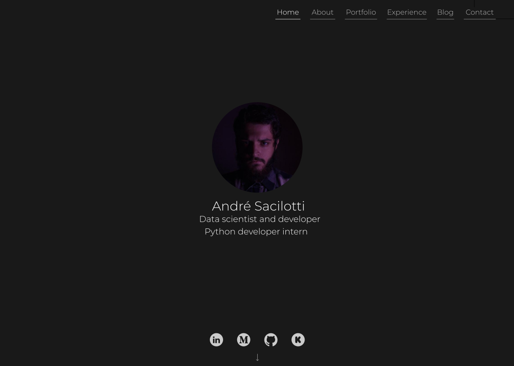

# Personal Resume

The idea here is to build my personal resume to include most important information's in a website style.
It will be made exclusively using React, with CRA, and other packages to deal with dynamic contents, like Axios to communicate
to my backend API.

## Pages Design

I'm not a designer, not even a enthusiast, but i tried to do my best. Its under development and of course can be changed.

### Home

### About Me

### Portfolio

